<picture>
  <source media="(prefers-color-scheme: dark)" srcset="./dark.svg">
  <source media="(prefers-color-scheme: light)" srcset="./light.svg">
  
</picture>

 

## About

Developer on GitHub — building and shipping small projects.

## Featured Projects

| Project | Description |
|---|---|
| [risk-sheid-ai](https://github.com/devakikowsik-star/risk-sheid-ai) | AI-related repository |
| [logistics-route-agent](https://github.com/devakikowsik-star/logistics-route-agent) | Route-planning agent project |
| [CodeAlpha_WebScraping](https://github.com/devakikowsik-star/CodeAlpha_WebScraping) | Web scraping project |
| [SCT_WD_2](https://github.com/devakikowsik-star/SCT_WD_2) | Web development repository |
| [SCT_WD_1](https://github.com/devakikowsik-star/SCT_WD_1) | Web development repository |
| [hello-node](https://github.com/devakikowsik-star/hello-node) | Node.js repository |
| [todo-list](https://github.com/devakikowsik-star/todo-list) | Todo list application |

## Connect

- GitHub: [github.com/devakikowsik-star](https://github.com/devakikowsik-star)
